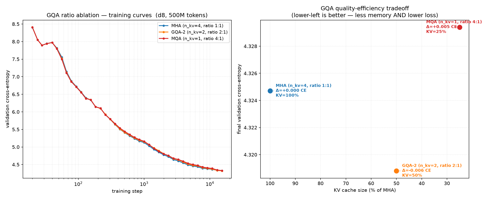

# GQA (Grouped Query Attention) Ratio Ablation

**Hypothesis:** Reducing the number of key/value heads (n_kv_head) in Grouped Query
Attention trades a small increase in validation loss for significant savings in
KV-cache memory. There exists a "sweet spot" ratio that captures most of the
memory benefit with negligible quality cost.

**Background:** Multi-Head Attention (MHA) computes separate K, V projections for
every query head, producing a KV cache of size 2 × n_head × d_head per token.
GQA shares K/V heads across groups of query heads, reducing the cache by a factor
of n_head / n_kv_head. Llama 3 70B uses GQA 8:1 (8 query heads per KV head);
smaller Llama 3 models use GQA 4:1. This ablation measures the quality cost of
increasing the sharing ratio at a fixed model scale.

**Experiment:**
- Control variable: `model.n_kv_head` ∈ {4 (MHA), 2 (GQA 2:1), 1 (MQA)}
- Model: d8 (depth=8, dim=512, n_head=4, ~75M total params)
- Data: FineWeb sample-10BT, 500M tokens (15,258 steps)
- Optimizer: AdamW, lr=3e-4, constant LR after 200 warmup steps, batch size 32,768
- 40 log-spaced eval points per arm, 512K val tokens each
- NVIDIA RTX PRO 6000 Blackwell Server Edition (96 GB)

| Arm | n_kv_head | GQA Ratio | KV Cache Size | KV Params |
|-----|-----------|-----------|---------------|-----------|
| MHA (baseline) | 4 | 1:1 | 100% | 100% |
| GQA-2 | 2 | 2:1 | 50% | 50% |
| MQA | 1 | 4:1 | 25% | 25% |

**Results:**

| Arm | Val CE (start → end) | Δ CE vs MHA | KV Cache |
|-----|----------------------|-------------|----------|
| MHA | — → — | 0.000 (baseline) | 100% |
| GQA-2 | — → — | — | 50% |
| MQA | — → — | — | 25% |

**Conclusion:** TBD — experiment running.



**Control check:** same model, data, optimizer, seed (42), and seed (42) for every
arm — only `n_kv_head` differs.

## How to Run

```bash
# Prerequisites: nanoinfra installed, FineWeb shards downloaded, tokenizer trained.
cd /path/to/nanoinfra
pip install -e .
python exemplars/text_pretrain/data/download_shards.py
python -m modalities.text.train_tokenizer

# Run the ablation
python gqa_ablation/run.py
python gqa_ablation/plot.py   # -> gqa_ablation.png
```
